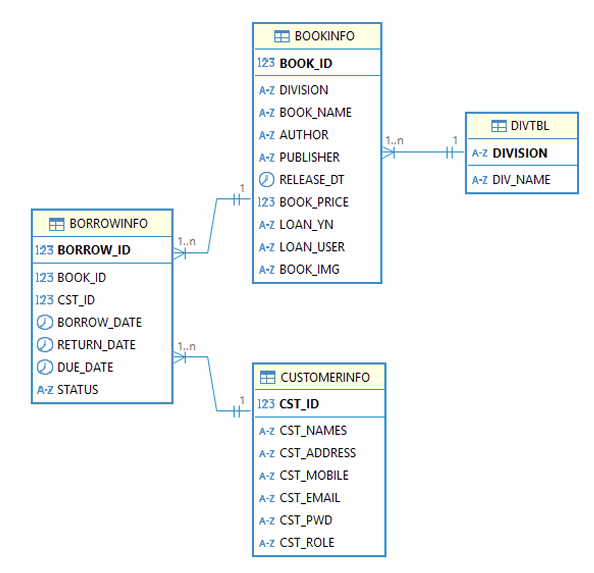
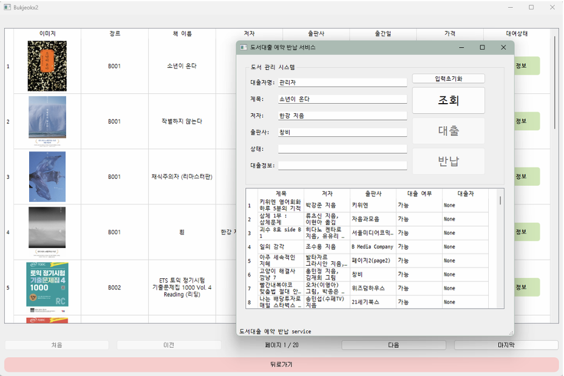
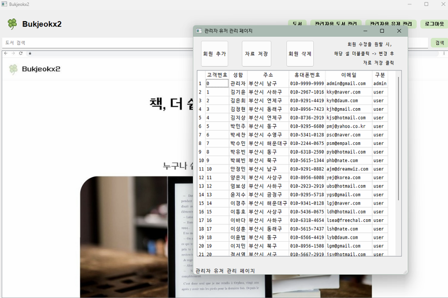

# 북적북적 (Bukjeokx2)

**PyQt 기반 전자도서관 시뮬레이션 프로젝트**

---

## 🧑‍🤝‍🧑 팀원 소개

| 이름   | 담당 역할                          |
|--------|-----------------------------------|
| 김은희 | 데이터 수집, DB 설계, UI 구현     |
| 김지상 | 데이터 수집, DB 설계, UI 구현     |
| 김정현 | DB 설계, DB 연동, UI 구현         |
| 정서영 | DB 설계, UI 설계, UI 구현         |

---

## 기술 스택

- **커뮤니케이션 도구**: Notion, KakaoTalk, Google Spreadsheet
- **개발 환경**: GitHub, VSCode, DBeaver, Python, Oracle 11g (Docker), Figma, PyQt5

---

## 프로젝트 개요

### 기존 전자도서관 시스템의 문제점
| 기존 서비스     | 한계점 |
|----------------|--------|
| 밀리의 서재     | 구독형만 제공, 대출·반납 개념 없음 |
| 공공 도서관     | UI 복잡, 검색 속도 느림, 접근성 낮음 |
| 학교 도서관     | 시스템 노후화, 모바일/전자책 미지원 |

### 해결하고자 하는 목표
- 무겁고 복잡한 기존 시스템 대신,
- 누구나 쉽게 접근 가능한 **직관적인 UI**
- PyQt 기반의 전자도서관 시뮬레이터
- **도서 대출 흐름 중심의 최소 기능 구현**

---

## 📆 개발 일정

| 날짜   | 작업 내용 |
|--------|-----------|
| Day 1  | 요구사항 정의서, 기능 우선순위, UI 흐름도, 와이어프레임, ERD 및 테이블 설계 |
| Day 2  | 로그인/회원가입 UI, 메인 페이지 UI, DB 연동 |
| Day 3  | 로그인/회원가입 기능, 도서 검색 화면 |
| Day 4  | 도서 등록/삭제/수정, 대출/반납 기능 |
| Day 5  | 전체 기능 통합, 예외처리 및 에러메시지 |
| Day 6  | UI 스타일 정리 |
| Day 7  | 발표자료 정리 및 리허설 |

---

## 🗃 DB 설계 및 연동

- **Oracle 11g (Docker)** 환경 + **DBeaver** 연동
- 테이블 구성
  - `BOOKINFO`: 도서 정보
  - `CUSTOMERINFO`: 사용자 정보
  - `BORROWINFO`: 대출 정보
  - `DIVTBL`: 분류 정보
- **기능 흐름**
  - 로그인 시 `CUSTOMERINFO`에서 이메일로 사용자 확인
  - 도서 대출 → `BOOKINFO`의 상태 변경 + `BORROWINFO` INSERT
  - 반납 시 `BORROWINFO` 상태 변경 및 도서 상태 복원

     

---

## UI 설계

- **디자인 컨셉**: 파스텔 연두톤 / 직관적인 UI / 둥근 버튼
- **기술 구성**: PyQt5 + Qt Designer 일부 + QMainWindow + QStackedWidget

### 사용자 흐름

```
      [메인페이지]
           ↓
        [로그인] 
        ↙     ↘
[유저기능]    [관리자기능]
     ↓              ↓
[도서목록]   [도서등록/수정]
     ↓              ↓
[도서대출/반납] [회원관리]
```

---

## 로그인 & 회원가입

- 로그인: 이메일 + 비밀번호 기반 인증 → 역할(관리자/유저)에 따라 분기
- 회원가입: 이름, 연락처, 이메일, 비밀번호 저장 → `CUSTOMERINFO`
- 예외 처리: 누락 입력 / 로그인 실패 시 알림

---

## 주요 기능

### 일반 사용자
- 도서 검색 및 대출/반납
- 도서 상세 정보 확인

    

### 관리자 기능
- 회원 관리 (추가/수정/삭제)
- 도서 등록 및 수정

    

---

## ✅ 구현 결과

- 핵심 기능 완성: 회원가입, 로그인, 도서조회, 대출/반납, 관리자 기능
- 안정적인 DB 연동, PyQt 기반 UI 구성

---

## 아쉬운 점 및 보완 방향

1. 마이페이지 기능 기본 틀 구현, 향후 확장 예정
2. UI 반응성 개선 및 예외처리 로직 강화 필요
3. 코드 통합/모듈화 측면에서 리팩토링 여지 있음

---

## 향후 발전 방향

- **마이페이지 확장**: 대출 이력, 연체 알림, 도서 예약, 찜 기능
- **검색 기능 정밀화**: 키워드, 저자, 출판사 필터링
- **참여형 기능 추가**: 리뷰 작성, 수요 기반 '읽고 싶은 책' 등록
- **광고 기반 수익화**: 추천 도서 배너, 제휴 출판사 신간 배너

---
